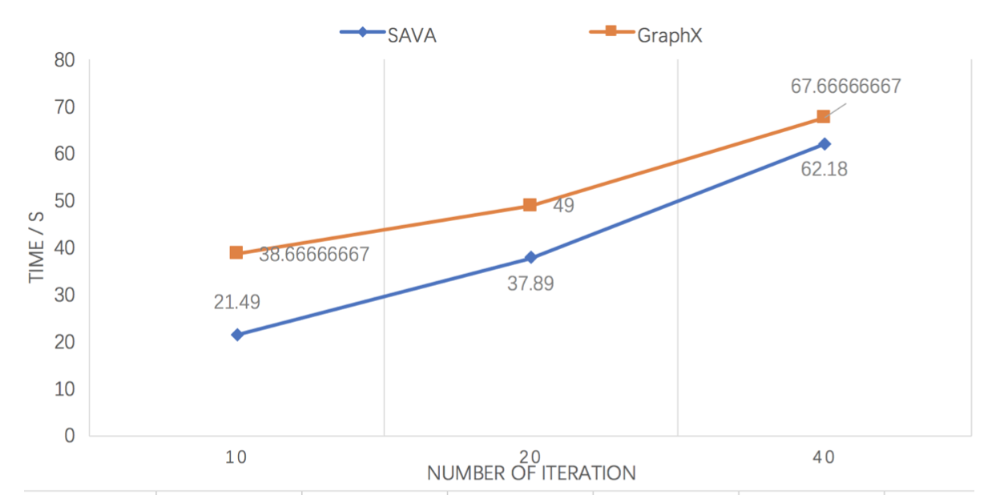

# SAVA
SAVA is a general graph processing system, named after a river in East Europe, passing through Belgrade. The basic design of Sava is very similar to the Pregel system that was discussed in class. Read the Pregel paper (also named after a river in East Europe)[https://dl.acm.org/citation.cfm?id=1807184](https://dl.acm.org/citation.cfm?id=1807184).

## feature
### SDFS
SDFS is a simplified hadoop distributed file system implemented by ourselves. SAVA stores the input graph and output results in SDFS.

### Fault tolerance
SAVA os tolerant to up to 2 simultaneous machine failures out of 8 machines.
When a machine fails, the master must restart the job itself from the very first iteration, and schedule the tasks quickly.

### General platfrom
Sava must admit generic graph processing applications. It is more like an interface.
We implemented two applications, PageRank and Single Source Shortest Path (SSSP).

### High performance
It has better performance compared to GraphX from Apache.
We run PageRank using graph with 334563 vertices and 925872 edges for 10 iterations, 20 iterations and 40 iterations.

## Design
For a job, Sava (just like Pregel) parallelizes it into tasks, assigns each task to a worker. The graph’s vertices are then partitioned across workers using a partitioning function. In the BSP/GAS model, tasks work in iterations across workers, with a barrier at the end of each iteration when the workers exchange data. 
Partitioning of graph is fully distributed and not dependent on master. For each vertex, we hash the vertexID and mod 10 to get the vmID it should be allocated. If the vm is not a worker, add 1 to vertexID and hash again.
A master server to receive commands from clients, and to coordinate activities among the other workers and servers (e.g., sending commands to them to start processing).
##### 1.Master
- 1.1 Superstep synchronization: Each worker need to send ACK to master(and standby master) after it finishes its computation. Master sends command to start next superstep.
- 1.2 Worker failure: When a worker fails, master sends out Start command to restart the job.
- 1.3 Standby master: Standby master keeps track of ACK from workers and stepcount. When master fails, standby master continues listening on workers and sends out command.
##### 2.Worker
- 2.1 Communication with master: worker listens on a specific port for master. On Start command from master, worker runs the graph partitioning algorithm and stores the vertex-vm relationship locally, then run the first superstep. After finishing each superstep, worker sends ACK to master and waits for Run command for next superstep.
- 2.2 Communication between workers: In each superstep, worker iterates all its active vertices and executes Compute() function. We use combiner to cache all outgoing messages to same vm and use mutex to provide mutual exclusion for combiner. After itearating all vertices, send out messages in combiner. We also use mutex to protect vertex status information and other critical section.
##### 3.Client
- Client sends job name and dataset to server through protocol buffer, then waits for result.

## Compiling instruction
**Go version needs to be higher than 1.9.1**.

Use `go get` to get dependencies (protocol buffer).

Then `cd` to each sub-directory and run `go build` will compile the program named correspondingly.

The programs are seperated into three parts:

 - Master : managing jobs
 - Worker : actually running jobs
 - Client : submitting jobs

Deploy all the code/executable across all nodes. There will be prompts in the terminal.

## Assumption
- Hostname on vm will always follow the format of `fa17-cs425-g28-%02d.cs.illinois.edu` so that our program can get node id from hostname.
